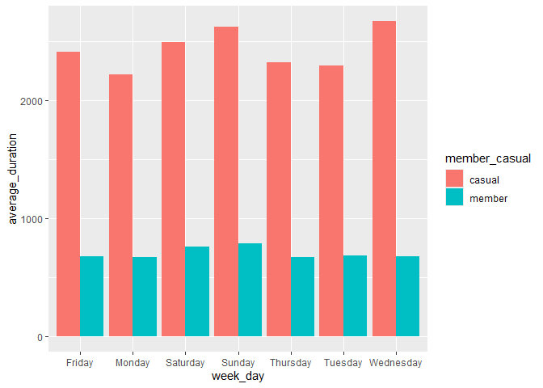

Case Study: How does a bike-share navigate speedy success?
================
Kalavakuri Abhinay

# Scenario

As a junior data analyst on the marketing analysis team at Cyclistic, a
bike-share company in Chicago, I am focused on maximizing the number of
annual memberships. Our director of marketing believes that the
company’s future success depends on this goal. To achieve it, I need to
understand how casual riders and annual members use Cyclistic bikes
differently. With these insights, I will help design a new marketing
strategy to convert casual riders into annual members. However, before
moving forward, I must present my recommendations to Cyclistic
executives, backed by compelling data insights and professional data
visualizations.

# Cyclistic Bike-Share Program Overview

In 2016, Cyclistic launched a successful bike-share offering. The
program has since grown to a fleet of 5,824 bicycles that are
geo-tracked and locked into a network of 692 stations across Chicago.
The bikes can be unlocked from one station and returned to any other
station in the system anytime.

## Marketing Strategy and Pricing Plans

Cyclistic’s marketing strategy has focused on building general awareness
and appealing to broad consumer segments. Key to this strategy has been
the flexibility of its pricing plans: single-ride passes, full-day
passes, and annual memberships. Customers who purchase single-ride or
full-day passes are referred to as casual riders, while customers who
purchase annual memberships are Cyclistic members.

## Profitability and Growth

Cyclistic’s finance analysts have concluded that annual members are much
more profitable than casual riders. Although the flexible pricing
attracts more customers, Moreno believes that maximizing the number of
annual members will be key to future growth. Instead of targeting
all-new customers, she sees an opportunity to convert casual riders into
members, as they are already familiar with the service.

## Business Task

The primary business task is to identify and understand the key
difference in how annual members and casual riders utilize cyclistic
bikes. This analysis aims to develop a strategy to convert casual riders
into annual members which ultimately increases the company’s
profitability.

**Key Stakeholders:**

- Lily Moreno (Director of Marketing) : Our Direct manager and the main
  stakeholder who utilizes our findings

- Cyclistic Marketing Analytics Team: Our team to collaborate on the
  analysis and recommendations.

- Cyclistic Executive Team: The final decision-makers who need to be
  present with compelling data insights and visualizations to approve
  the marketing program.

# Prepare

**Data Sources:** Considering Divvy_Trips_2019_Q1.csv &
Divvy_Trips_2020_Q1.csv data from [Divvy-Trip
dataset](https://divvy-tripdata.s3.amazonaws.com/index.html).

**Data Organization:**  Each csv file is organized by individual bike
trips with following data points:

Ride id, Type of Ride, Start and End Time-stamps, Start and End station
names & IDs, User Type (Member/ Casual) as common in both files and
gender, birth year, bike-id in other file.

**ROCCC Analysis:**

- **Reliable:** The data is sourced internally, making it relatively
  reliable for analyzing user behavior.

- **Original:** The data originates from Cyclistic’s own systems.

- **Comprehensive:** The data includes essential information for our
  analysis; however, we lack details about users’ demographics, reasons
  for travel, and other factors that could be insightful.

- **Current:** The data covers the past 12 months, which is sufficiently
  recent for understanding current usage patterns.

- **Cited:** The data is internally sourced from Cyclistic.

**Licensing, Privacy, Security & Accessibility:**

- The data provided has been anonymized to protect riders’ personal
  information.

- We will handle the data securely, restricting access and using it only
  for this analysis.

# Process

The datasets doesn’t contain Day of the Week, Date, Month, Year, Ride
Duration (in Seconds and in hrs:mm format) using Excel to obtain the
required attributes by

=TEXT(cell,“dd”) \# for date (“dddd” for name of the day in week, “mm”
for month and “yyyy” for year) format.

and saving them in .csv formats. Also, Formating the started_at column
as date type in both files in excel.

# Analysis

## Load Libraries

``` r
# Load necessary libraries
library(tidyverse)
```

    ## ── Attaching core tidyverse packages ──────────────────────── tidyverse 2.0.0 ──
    ## ✔ dplyr     1.1.4     ✔ readr     2.1.5
    ## ✔ forcats   1.0.0     ✔ stringr   1.5.1
    ## ✔ ggplot2   3.5.1     ✔ tibble    3.2.1
    ## ✔ lubridate 1.9.3     ✔ tidyr     1.3.1
    ## ✔ purrr     1.0.2     
    ## ── Conflicts ────────────────────────────────────────── tidyverse_conflicts() ──
    ## ✖ dplyr::filter() masks stats::filter()
    ## ✖ dplyr::lag()    masks stats::lag()
    ## ℹ Use the conflicted package (<http://conflicted.r-lib.org/>) to force all conflicts to become errors

``` r
library(lubridate)
library(ggplot2)
library(dplyr)
library(tidyr)

#or install if required
#install.packages("tidyverse")
#install.packages("lubridate")
```

## Data Import and Preparation

``` r
# Import data
q1_2019 <- read_csv("Dataset/Divvy_Trips_2019_Q1.csv")
```

    ## Rows: 365069 Columns: 18
    ## ── Column specification ────────────────────────────────────────────────────────
    ## Delimiter: ","
    ## chr  (7): start_time, end_time, from_station_name, to_station_name, usertype...
    ## dbl  (9): trip_id, bikeid, from_station_id, to_station_id, birthyear, date, ...
    ## num  (1): tripduration
    ## time (1): ride_length
    ## 
    ## ℹ Use `spec()` to retrieve the full column specification for this data.
    ## ℹ Specify the column types or set `show_col_types = FALSE` to quiet this message.

``` r
q1_2020 <- read_csv("Dataset/Divvy_Trips_2020_Q1.csv")
```

    ## Warning: One or more parsing issues, call `problems()` on your data frame for details,
    ## e.g.:
    ##   dat <- vroom(...)
    ##   problems(dat)

    ## Rows: 426887 Columns: 19
    ## ── Column specification ────────────────────────────────────────────────────────
    ## Delimiter: ","
    ## chr   (8): ride_id, rideable_type, started_at, ended_at, start_station_name,...
    ## dbl  (10): start_station_id, end_station_id, start_lat, start_lng, end_lat, ...
    ## time  (1): ride_length
    ## 
    ## ℹ Use `spec()` to retrieve the full column specification for this data.
    ## ℹ Specify the column types or set `show_col_types = FALSE` to quiet this message.

``` r
# Finding Column Names in both datasets
colnames(q1_2019)
```

    ##  [1] "trip_id"           "start_time"        "end_time"         
    ##  [4] "bikeid"            "tripduration"      "from_station_id"  
    ##  [7] "from_station_name" "to_station_id"     "to_station_name"  
    ## [10] "usertype"          "gender"            "birthyear"        
    ## [13] "ride_length"       "week_day"          "date"             
    ## [16] "month"             "year"              "ride_sec"

``` r
colnames(q1_2020)
```

    ##  [1] "ride_id"            "rideable_type"      "started_at"        
    ##  [4] "ended_at"           "start_station_name" "start_station_id"  
    ##  [7] "end_station_name"   "end_station_id"     "start_lat"         
    ## [10] "start_lng"          "end_lat"            "end_lng"           
    ## [13] "member_casual"      "ride_length"        "week_day"          
    ## [16] "date"               "month"              "year"              
    ## [19] "ride_sec"

There is inconsistency in the column names of both files. So changing
all names into 2020 set.

``` r
q1_2019 <- rename(q1_2019,ride_id=trip_id,rideable_type = bikeid
 ,started_at = start_time
 ,ended_at = end_time
 ,start_station_name = from_station_name
 ,start_station_id = from_station_id
 ,end_station_name = to_station_name
 ,end_station_id = to_station_id
 ,member_casual = usertype)
```

``` r
str(q1_2019)  # Checking the Type of Data
```

    ## spc_tbl_ [365,069 × 18] (S3: spec_tbl_df/tbl_df/tbl/data.frame)
    ##  $ ride_id           : num [1:365069] 21742443 21742444 21742445 21742446 21742447 ...
    ##  $ started_at        : chr [1:365069] "1/1/2019 0:04" "1/1/2019 0:08" "1/1/2019 0:13" "1/1/2019 0:13" ...
    ##  $ ended_at          : chr [1:365069] "1/1/2019 0:11" "1/1/2019 0:15" "1/1/2019 0:27" "1/1/2019 0:43" ...
    ##  $ rideable_type     : num [1:365069] 2167 4386 1524 252 1170 ...
    ##  $ tripduration      : num [1:365069] 390 441 829 1783 364 ...
    ##  $ start_station_id  : num [1:365069] 199 44 15 123 173 98 98 211 150 268 ...
    ##  $ start_station_name: chr [1:365069] "Wabash Ave & Grand Ave" "State St & Randolph St" "Racine Ave & 18th St" "California Ave & Milwaukee Ave" ...
    ##  $ end_station_id    : num [1:365069] 84 624 644 176 35 49 49 142 148 141 ...
    ##  $ end_station_name  : chr [1:365069] "Milwaukee Ave & Grand Ave" "Dearborn St & Van Buren St (*)" "Western Ave & Fillmore St (*)" "Clark St & Elm St" ...
    ##  $ member_casual     : chr [1:365069] "Subscriber" "Subscriber" "Subscriber" "Subscriber" ...
    ##  $ gender            : chr [1:365069] "Male" "Female" "Female" "Male" ...
    ##  $ birthyear         : num [1:365069] 1989 1990 1994 1993 1994 ...
    ##  $ ride_length       : 'hms' num [1:365069] 00:06:30 00:07:21 00:13:49 00:29:43 ...
    ##   ..- attr(*, "units")= chr "secs"
    ##  $ week_day          : chr [1:365069] "Tuesday" "Tuesday" "Tuesday" "Tuesday" ...
    ##  $ date              : num [1:365069] 1 1 1 1 1 1 1 1 1 1 ...
    ##  $ month             : num [1:365069] 1 1 1 1 1 1 1 1 1 1 ...
    ##  $ year              : num [1:365069] 2019 2019 2019 2019 2019 ...
    ##  $ ride_sec          : num [1:365069] 390 441 829 1783 364 ...
    ##  - attr(*, "spec")=
    ##   .. cols(
    ##   ..   trip_id = col_double(),
    ##   ..   start_time = col_character(),
    ##   ..   end_time = col_character(),
    ##   ..   bikeid = col_double(),
    ##   ..   tripduration = col_number(),
    ##   ..   from_station_id = col_double(),
    ##   ..   from_station_name = col_character(),
    ##   ..   to_station_id = col_double(),
    ##   ..   to_station_name = col_character(),
    ##   ..   usertype = col_character(),
    ##   ..   gender = col_character(),
    ##   ..   birthyear = col_double(),
    ##   ..   ride_length = col_time(format = ""),
    ##   ..   week_day = col_character(),
    ##   ..   date = col_double(),
    ##   ..   month = col_double(),
    ##   ..   year = col_double(),
    ##   ..   ride_sec = col_double()
    ##   .. )
    ##  - attr(*, "problems")=<externalptr>

``` r
str(q1_2020)
```

    ## spc_tbl_ [426,887 × 19] (S3: spec_tbl_df/tbl_df/tbl/data.frame)
    ##  $ ride_id           : chr [1:426887] "EACB19130B0CDA4A" "8FED874C809DC021" "789F3C21E472CA96" "C9A388DAC6ABF313" ...
    ##  $ rideable_type     : chr [1:426887] "docked_bike" "docked_bike" "docked_bike" "docked_bike" ...
    ##  $ started_at        : chr [1:426887] "1/21/2020 20:06" "1/30/2020 14:22" "1/9/2020 19:29" "1/6/2020 16:17" ...
    ##  $ ended_at          : chr [1:426887] "1/21/2020 20:14" "1/30/2020 14:26" "1/9/2020 19:32" "1/6/2020 16:25" ...
    ##  $ start_station_name: chr [1:426887] "Western Ave & Leland Ave" "Clark St & Montrose Ave" "Broadway & Belmont Ave" "Clark St & Randolph St" ...
    ##  $ start_station_id  : num [1:426887] 239 234 296 51 66 212 96 96 212 38 ...
    ##  $ end_station_name  : chr [1:426887] "Clark St & Leland Ave" "Southport Ave & Irving Park Rd" "Wilton Ave & Belmont Ave" "Fairbanks Ct & Grand Ave" ...
    ##  $ end_station_id    : num [1:426887] 326 318 117 24 212 96 212 212 96 100 ...
    ##  $ start_lat         : num [1:426887] 42 42 41.9 41.9 41.9 ...
    ##  $ start_lng         : num [1:426887] -87.7 -87.7 -87.6 -87.6 -87.6 ...
    ##  $ end_lat           : num [1:426887] 42 42 41.9 41.9 41.9 ...
    ##  $ end_lng           : num [1:426887] -87.7 -87.7 -87.7 -87.6 -87.6 ...
    ##  $ member_casual     : chr [1:426887] "member" "member" "member" "member" ...
    ##  $ ride_length       : 'hms' num [1:426887] 00:07:31 00:03:43 00:02:51 00:08:49 ...
    ##   ..- attr(*, "units")= chr "secs"
    ##  $ week_day          : chr [1:426887] "Tuesday" "Thursday" "Thursday" "Monday" ...
    ##  $ date              : num [1:426887] 21 30 9 6 30 10 10 10 31 31 ...
    ##  $ month             : num [1:426887] 1 1 1 1 1 1 1 1 1 1 ...
    ##  $ year              : num [1:426887] 2020 2020 2020 2020 2020 2020 2020 2020 2020 2020 ...
    ##  $ ride_sec          : num [1:426887] 451 223 171 529 332 289 289 297 295 203 ...
    ##  - attr(*, "spec")=
    ##   .. cols(
    ##   ..   ride_id = col_character(),
    ##   ..   rideable_type = col_character(),
    ##   ..   started_at = col_character(),
    ##   ..   ended_at = col_character(),
    ##   ..   start_station_name = col_character(),
    ##   ..   start_station_id = col_double(),
    ##   ..   end_station_name = col_character(),
    ##   ..   end_station_id = col_double(),
    ##   ..   start_lat = col_double(),
    ##   ..   start_lng = col_double(),
    ##   ..   end_lat = col_double(),
    ##   ..   end_lng = col_double(),
    ##   ..   member_casual = col_character(),
    ##   ..   ride_length = col_time(format = ""),
    ##   ..   week_day = col_character(),
    ##   ..   date = col_double(),
    ##   ..   month = col_double(),
    ##   ..   year = col_double(),
    ##   ..   ride_sec = col_double()
    ##   .. )
    ##  - attr(*, "problems")=<externalptr>

``` r
 q1_2019 <- mutate(q1_2019, ride_id = as.character(ride_id)
 ,rideable_type = as.character(rideable_type))
```

## Processing Data

``` r
combined_data <- bind_rows(q1_2019,q1_2020) # Merging Datasets
```

``` r
colnames(combined_data) 
```

    ##  [1] "ride_id"            "started_at"         "ended_at"          
    ##  [4] "rideable_type"      "tripduration"       "start_station_id"  
    ##  [7] "start_station_name" "end_station_id"     "end_station_name"  
    ## [10] "member_casual"      "gender"             "birthyear"         
    ## [13] "ride_length"        "week_day"           "date"              
    ## [16] "month"              "year"               "ride_sec"          
    ## [19] "start_lat"          "start_lng"          "end_lat"           
    ## [22] "end_lng"

``` r
combined_data <- combined_data %>% select (-c("start_lat","start_lng","end_lat","end_lng","gender","birthyear","tripduration")) # Dropping Unnecessary Data Columns
```

``` r
colnames(combined_data)
```

    ##  [1] "ride_id"            "started_at"         "ended_at"          
    ##  [4] "rideable_type"      "start_station_id"   "start_station_name"
    ##  [7] "end_station_id"     "end_station_name"   "member_casual"     
    ## [10] "ride_length"        "week_day"           "date"              
    ## [13] "month"              "year"               "ride_sec"

``` r
dim(combined_data) # Checking Dimensions of the Dataset
```

    ## [1] 791956     15

Data Contains 791956 observations and 15 variables currently.

``` r
head(combined_data)  # Preview of Data
```

<div data-pagedtable="false">

<script data-pagedtable-source type="application/json">
{"columns":[{"label":["ride_id"],"name":[1],"type":["chr"],"align":["left"]},{"label":["started_at"],"name":[2],"type":["chr"],"align":["left"]},{"label":["ended_at"],"name":[3],"type":["chr"],"align":["left"]},{"label":["rideable_type"],"name":[4],"type":["chr"],"align":["left"]},{"label":["start_station_id"],"name":[5],"type":["dbl"],"align":["right"]},{"label":["start_station_name"],"name":[6],"type":["chr"],"align":["left"]},{"label":["end_station_id"],"name":[7],"type":["dbl"],"align":["right"]},{"label":["end_station_name"],"name":[8],"type":["chr"],"align":["left"]},{"label":["member_casual"],"name":[9],"type":["chr"],"align":["left"]},{"label":["ride_length"],"name":[10],"type":["time"],"align":["right"]},{"label":["week_day"],"name":[11],"type":["chr"],"align":["left"]},{"label":["date"],"name":[12],"type":["dbl"],"align":["right"]},{"label":["month"],"name":[13],"type":["dbl"],"align":["right"]},{"label":["year"],"name":[14],"type":["dbl"],"align":["right"]},{"label":["ride_sec"],"name":[15],"type":["dbl"],"align":["right"]}],"data":[{"1":"21742443","2":"1/1/2019 0:04","3":"1/1/2019 0:11","4":"2167","5":"199","6":"Wabash Ave & Grand Ave","7":"84","8":"Milwaukee Ave & Grand Ave","9":"Subscriber","10":"00:06:30","11":"Tuesday","12":"1","13":"1","14":"2019","15":"390"},{"1":"21742444","2":"1/1/2019 0:08","3":"1/1/2019 0:15","4":"4386","5":"44","6":"State St & Randolph St","7":"624","8":"Dearborn St & Van Buren St (*)","9":"Subscriber","10":"00:07:21","11":"Tuesday","12":"1","13":"1","14":"2019","15":"441"},{"1":"21742445","2":"1/1/2019 0:13","3":"1/1/2019 0:27","4":"1524","5":"15","6":"Racine Ave & 18th St","7":"644","8":"Western Ave & Fillmore St (*)","9":"Subscriber","10":"00:13:49","11":"Tuesday","12":"1","13":"1","14":"2019","15":"829"},{"1":"21742446","2":"1/1/2019 0:13","3":"1/1/2019 0:43","4":"252","5":"123","6":"California Ave & Milwaukee Ave","7":"176","8":"Clark St & Elm St","9":"Subscriber","10":"00:29:43","11":"Tuesday","12":"1","13":"1","14":"2019","15":"1783"},{"1":"21742447","2":"1/1/2019 0:14","3":"1/1/2019 0:20","4":"1170","5":"173","6":"Mies van der Rohe Way & Chicago Ave","7":"35","8":"Streeter Dr & Grand Ave","9":"Subscriber","10":"00:06:04","11":"Tuesday","12":"1","13":"1","14":"2019","15":"364"},{"1":"21742448","2":"1/1/2019 0:15","3":"1/1/2019 0:19","4":"2437","5":"98","6":"LaSalle St & Washington St","7":"49","8":"Dearborn St & Monroe St","9":"Subscriber","10":"00:03:36","11":"Tuesday","12":"1","13":"1","14":"2019","15":"216"}],"options":{"columns":{"min":{},"max":[10]},"rows":{"min":[10],"max":[10]},"pages":{}}}
  </script>

</div>

``` r
combined_data <- na.omit(combined_data)  # dropping null values by rows
```

``` r
dim(combined_data)
```

    ## [1] 791839     15

**Dropped around 117 null points.**

``` r
head(combined_data)
```

<div data-pagedtable="false">

<script data-pagedtable-source type="application/json">
{"columns":[{"label":["ride_id"],"name":[1],"type":["chr"],"align":["left"]},{"label":["started_at"],"name":[2],"type":["chr"],"align":["left"]},{"label":["ended_at"],"name":[3],"type":["chr"],"align":["left"]},{"label":["rideable_type"],"name":[4],"type":["chr"],"align":["left"]},{"label":["start_station_id"],"name":[5],"type":["dbl"],"align":["right"]},{"label":["start_station_name"],"name":[6],"type":["chr"],"align":["left"]},{"label":["end_station_id"],"name":[7],"type":["dbl"],"align":["right"]},{"label":["end_station_name"],"name":[8],"type":["chr"],"align":["left"]},{"label":["member_casual"],"name":[9],"type":["chr"],"align":["left"]},{"label":["ride_length"],"name":[10],"type":["time"],"align":["right"]},{"label":["week_day"],"name":[11],"type":["chr"],"align":["left"]},{"label":["date"],"name":[12],"type":["dbl"],"align":["right"]},{"label":["month"],"name":[13],"type":["dbl"],"align":["right"]},{"label":["year"],"name":[14],"type":["dbl"],"align":["right"]},{"label":["ride_sec"],"name":[15],"type":["dbl"],"align":["right"]}],"data":[{"1":"21742443","2":"1/1/2019 0:04","3":"1/1/2019 0:11","4":"2167","5":"199","6":"Wabash Ave & Grand Ave","7":"84","8":"Milwaukee Ave & Grand Ave","9":"Subscriber","10":"00:06:30","11":"Tuesday","12":"1","13":"1","14":"2019","15":"390"},{"1":"21742444","2":"1/1/2019 0:08","3":"1/1/2019 0:15","4":"4386","5":"44","6":"State St & Randolph St","7":"624","8":"Dearborn St & Van Buren St (*)","9":"Subscriber","10":"00:07:21","11":"Tuesday","12":"1","13":"1","14":"2019","15":"441"},{"1":"21742445","2":"1/1/2019 0:13","3":"1/1/2019 0:27","4":"1524","5":"15","6":"Racine Ave & 18th St","7":"644","8":"Western Ave & Fillmore St (*)","9":"Subscriber","10":"00:13:49","11":"Tuesday","12":"1","13":"1","14":"2019","15":"829"},{"1":"21742446","2":"1/1/2019 0:13","3":"1/1/2019 0:43","4":"252","5":"123","6":"California Ave & Milwaukee Ave","7":"176","8":"Clark St & Elm St","9":"Subscriber","10":"00:29:43","11":"Tuesday","12":"1","13":"1","14":"2019","15":"1783"},{"1":"21742447","2":"1/1/2019 0:14","3":"1/1/2019 0:20","4":"1170","5":"173","6":"Mies van der Rohe Way & Chicago Ave","7":"35","8":"Streeter Dr & Grand Ave","9":"Subscriber","10":"00:06:04","11":"Tuesday","12":"1","13":"1","14":"2019","15":"364"},{"1":"21742448","2":"1/1/2019 0:15","3":"1/1/2019 0:19","4":"2437","5":"98","6":"LaSalle St & Washington St","7":"49","8":"Dearborn St & Monroe St","9":"Subscriber","10":"00:03:36","11":"Tuesday","12":"1","13":"1","14":"2019","15":"216"}],"options":{"columns":{"min":{},"max":[10]},"rows":{"min":[10],"max":[10]},"pages":{}}}
  </script>

</div>

``` r
summary(combined_data)
```

    ##    ride_id           started_at          ended_at         rideable_type     
    ##  Length:791839      Length:791839      Length:791839      Length:791839     
    ##  Class :character   Class :character   Class :character   Class :character  
    ##  Mode  :character   Mode  :character   Mode  :character   Mode  :character  
    ##                                                                             
    ##                                                                             
    ##                                                                             
    ##  start_station_id start_station_name end_station_id  end_station_name  
    ##  Min.   :  2.0    Length:791839      Min.   :  2.0   Length:791839     
    ##  1st Qu.: 77.0    Class :character   1st Qu.: 77.0   Class :character  
    ##  Median :174.0    Mode  :character   Median :174.0   Mode  :character  
    ##  Mean   :204.3                       Mean   :204.3                     
    ##  3rd Qu.:291.0                       3rd Qu.:291.0                     
    ##  Max.   :675.0                       Max.   :675.0                     
    ##  member_casual      ride_length         week_day              date      
    ##  Length:791839      Length:791839     Length:791839      Min.   : 1.00  
    ##  Class :character   Class1:hms        Class :character   1st Qu.: 7.00  
    ##  Mode  :character   Class2:difftime   Mode  :character   Median :14.00  
    ##                     Mode  :numeric                       Mean   :14.75  
    ##                                                          3rd Qu.:22.00  
    ##                                                          Max.   :31.00  
    ##      month            year         ride_sec      
    ##  Min.   :1.000   Min.   :2019   Min.   :    0.0  
    ##  1st Qu.:1.000   1st Qu.:2019   1st Qu.:  328.0  
    ##  Median :2.000   Median :2020   Median :  537.0  
    ##  Mean   :2.078   Mean   :2020   Mean   :  841.8  
    ##  3rd Qu.:3.000   3rd Qu.:2020   3rd Qu.:  910.0  
    ##  Max.   :3.000   Max.   :2020   Max.   :86274.0

Focusing on Member_Casual Column

``` r
table(combined_data$member_casual)
```

    ## 
    ##     casual   Customer     member Subscriber 
    ##      48363      23163     378407     341906

There is some inconsistency in the data because of having 2 names for
members (“Member” and “Subscriber”) and 2 names for casual riders
(“Customer” and ” Casual”). So replacing them.

``` r
combined_data <- combined_data %>% mutate(member_casual= recode(member_casual,"Subscriber" = "member","Customer"="casual"))
```

``` r
table(combined_data$member_casual)
```

    ## 
    ## casual member 
    ##  71526 720313

**Filtering Data as per requirments**

``` r
combined_data <- combined_data[!(combined_data$start_station_name == "HQ QR" | combined_data$ride_sec < 0), ]
```

``` r
dim(combined_data)  # Final Datapoints
```

    ## [1] 788189     15

**Cleaned Around 3767 data-points.**

## Data Summary

``` r
print(paste("Average of ride (Sec): ",mean(combined_data$ride_sec)))
```

    ## [1] "Average of ride (Sec):  845.695453755381"

``` r
print(paste("Meadian of ride (Sec): ", median(combined_data$ride_sec)))
```

    ## [1] "Meadian of ride (Sec):  539"

``` r
print(paste("Longest ride (Sec): ", max(combined_data$ride_sec)))
```

    ## [1] "Longest ride (Sec):  86274"

``` r
print(paste("Shortest ride (Sec): ", min(combined_data$ride_sec)))
```

    ## [1] "Shortest ride (Sec):  1"

``` r
summary(combined_data$ride_sec)
```

    ##    Min. 1st Qu.  Median    Mean 3rd Qu.    Max. 
    ##     1.0   331.0   539.0   845.7   912.0 86274.0

## Comparing

``` r
 aggregate(combined_data$ride_sec ~ combined_data$member_casual, FUN = mean)
```

<div data-pagedtable="false">

<script data-pagedtable-source type="application/json">
{"columns":[{"label":["combined_data$member_casual"],"name":[1],"type":["chr"],"align":["left"]},{"label":["combined_data$ride_sec"],"name":[2],"type":["dbl"],"align":["right"]}],"data":[{"1":"casual","2":"2478.2305"},{"1":"member","2":"691.8571"}],"options":{"columns":{"min":{},"max":[10]},"rows":{"min":[10],"max":[10]},"pages":{}}}
  </script>

</div>

``` r
 aggregate(combined_data$ride_sec ~ combined_data$member_casual, FUN = median)
```

<div data-pagedtable="false">

<script data-pagedtable-source type="application/json">
{"columns":[{"label":["combined_data$member_casual"],"name":[1],"type":["chr"],"align":["left"]},{"label":["combined_data$ride_sec"],"name":[2],"type":["dbl"],"align":["right"]}],"data":[{"1":"casual","2":"1392"},{"1":"member","2":"508"}],"options":{"columns":{"min":{},"max":[10]},"rows":{"min":[10],"max":[10]},"pages":{}}}
  </script>

</div>

``` r
 aggregate(combined_data$ride_sec ~ combined_data$member_casual, FUN = max)
```

<div data-pagedtable="false">

<script data-pagedtable-source type="application/json">
{"columns":[{"label":["combined_data$member_casual"],"name":[1],"type":["chr"],"align":["left"]},{"label":["combined_data$ride_sec"],"name":[2],"type":["dbl"],"align":["right"]}],"data":[{"1":"casual","2":"86274"},{"1":"member","2":"85984"}],"options":{"columns":{"min":{},"max":[10]},"rows":{"min":[10],"max":[10]},"pages":{}}}
  </script>

</div>

``` r
 aggregate(combined_data$ride_sec ~ combined_data$member_casual, FUN = min)
```

<div data-pagedtable="false">

<script data-pagedtable-source type="application/json">
{"columns":[{"label":["combined_data$member_casual"],"name":[1],"type":["chr"],"align":["left"]},{"label":["combined_data$ride_sec"],"name":[2],"type":["dbl"],"align":["right"]}],"data":[{"1":"casual","2":"2"},{"1":"member","2":"1"}],"options":{"columns":{"min":{},"max":[10]},"rows":{"min":[10],"max":[10]},"pages":{}}}
  </script>

</div>

``` r
# average ride time by each day for members vs casual users
aggregate(combined_data$ride_sec ~ combined_data$member_casual + combined_data$week_day,
 FUN =mean)
```

<div data-pagedtable="false">

<script data-pagedtable-source type="application/json">
{"columns":[{"label":["combined_data$member_casual"],"name":[1],"type":["chr"],"align":["left"]},{"label":["combined_data$week_day"],"name":[2],"type":["chr"],"align":["left"]},{"label":["combined_data$ride_sec"],"name":[3],"type":["dbl"],"align":["right"]}],"data":[{"1":"casual","2":"Friday","3":"2413.9121"},{"1":"member","2":"Friday","3":"675.9502"},{"1":"casual","2":"Monday","3":"2217.6916"},{"1":"member","2":"Monday","3":"670.5264"},{"1":"casual","2":"Saturday","3":"2494.6586"},{"1":"member","2":"Saturday","3":"760.3016"},{"1":"casual","2":"Sunday","3":"2624.7614"},{"1":"member","2":"Sunday","3":"784.9157"},{"1":"casual","2":"Thursday","3":"2322.5497"},{"1":"member","2":"Thursday","3":"668.5725"},{"1":"casual","2":"Tuesday","3":"2292.7846"},{"1":"member","2":"Tuesday","3":"685.0495"},{"1":"casual","2":"Wednesday","3":"2671.4778"},{"1":"member","2":"Wednesday","3":"677.9630"}],"options":{"columns":{"min":{},"max":[10]},"rows":{"min":[10],"max":[10]},"pages":{}}}
  </script>

</div>

``` r
combined_data %>% group_by(member_casual,week_day) %>% summarise(number_of_rides=n(),average_duration=mean(ride_sec),.groups="keep") %>% arrange(member_casual,week_day)
```

<div data-pagedtable="false">

<script data-pagedtable-source type="application/json">
{"columns":[{"label":["member_casual"],"name":[1],"type":["chr"],"align":["left"]},{"label":["week_day"],"name":[2],"type":["chr"],"align":["left"]},{"label":["number_of_rides"],"name":[3],"type":["int"],"align":["right"]},{"label":["average_duration"],"name":[4],"type":["dbl"],"align":["right"]}],"data":[{"1":"casual","2":"Friday","3":"8013","4":"2413.9121"},{"1":"casual","2":"Monday","3":"5591","4":"2217.6916"},{"1":"casual","2":"Saturday","3":"13473","4":"2494.6586"},{"1":"casual","2":"Sunday","3":"18652","4":"2624.7614"},{"1":"casual","2":"Thursday","3":"7147","4":"2322.5497"},{"1":"casual","2":"Tuesday","3":"7311","4":"2292.7846"},{"1":"casual","2":"Wednesday","3":"7690","4":"2671.4778"},{"1":"member","2":"Friday","3":"115168","4":"675.9502"},{"1":"member","2":"Monday","3":"110430","4":"670.5264"},{"1":"member","2":"Saturday","3":"59413","4":"760.3016"},{"1":"member","2":"Sunday","3":"60197","4":"784.9157"},{"1":"member","2":"Thursday","3":"125228","4":"668.5725"},{"1":"member","2":"Tuesday","3":"127974","4":"685.0495"},{"1":"member","2":"Wednesday","3":"121902","4":"677.9630"}],"options":{"columns":{"min":{},"max":[10]},"rows":{"min":[10],"max":[10]},"pages":{}}}
  </script>

</div>

## Data Visualization

``` r
 # Let's visualize the number of rides by rider type
combined_data %>% group_by(member_casual,week_day) %>% summarise(number_of_rides=n(),average_duration=mean(ride_sec),.groups = "keep") %>% arrange(member_casual,week_day) %>% ggplot(aes(x=week_day,y=number_of_rides,fill=member_casual))+geom_col(position = "dodge")
```

<!-- -->

``` r
 # Let's create a visualization for average duration
combined_data %>% group_by(member_casual,week_day) %>% summarise(number_of_rides=n(),average_duration=mean(ride_sec),.groups = "keep") %>% arrange(member_casual,week_day) %>% ggplot(aes(x=week_day,y=average_duration,fill=member_casual))+geom_col(position = "dodge")
```

<!-- -->

``` r
#Exporting for futher analysis

counts <- aggregate(combined_data$ride_sec ~combined_data$member_casual+combined_data$week_day,FUN = mean)

#write_csv(counts,"avg_ride_length.csv")
```

## Interpretation

- **Member usage:** Members exhibit a consistent usage pattern
  throughout the week, suggesting they likely use the service for
  commuting or other regular activities. Their rides are typically
  shorter in duration.

- **Casual rider usage:** Casual riders tend to use the service more
  frequently on weekends, possibly for recreational purposes. Their
  rides are generally longer than those of members.

# Recommendations

- Implement limited-time discount on first month or year of membership
  to attract casual riders.

- Offer Exclusive perks to members, such as priority access to bikes
  during peak times and discounts at partner businesses.

# References

- [R Markdown Documentation](https://rmarkdown.rstudio.com)
- [ggplot2 Documentation](https://ggplot2.tidyverse.org)
- [R Language](https://www.r-project.org/other-docs.html)
